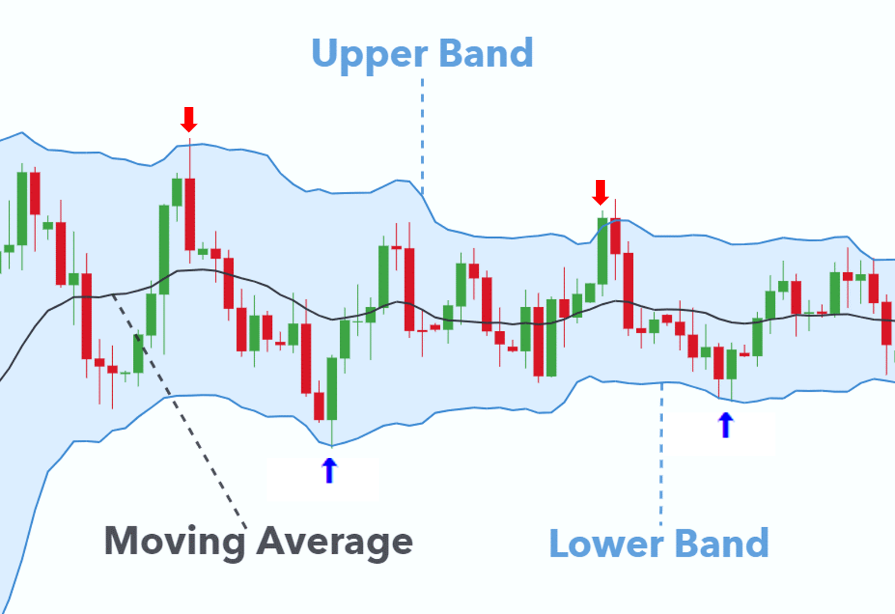
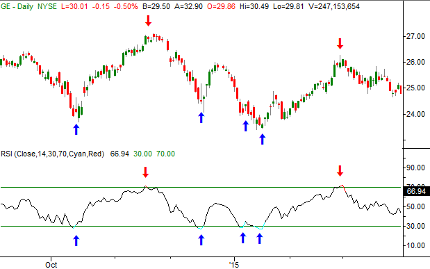

# Trading Strategies - Image Classification

This repository contains all the files of the stock prediction project, related to my Machine Learning class.

# Table of Contents
- [Overview](#overview)
- [Introduction](#introduction)
- [Trading Strategies](#trading-strategies)
  - [1. Bollinger Bands](#1-bollinger-bands)
  - [2. Relative Strength Index](#2-relative-strength-index)
- [Methodology](#methodology)
  - [1. Image Generation](#1image-generation)
    - [Data Collection](#data-collection)
    - [Data Preparation](#data-preparation)
    - [Signal Generation](#signal-generation)
      - [Buy vs Sell](#buy-vs-sell)
      - [Buy vs Sell/Hold](#buy-vs-sellhold)
  - [2. Feature Engineering](#2feature-engineering)
    - [Convolution](#convolution)
    - [Max Pooling](#max-pooling)
  - [3. Modeling](#3modeling)
    - [Train & Validation Split](#train--validation-split)
    - [Model Architecture](#model-architecture)    
    - [Model Selection](#performance-metrics)
- [Conclusion](#conclusion)
  
## Overview
Trading decisions have always been subjective i.e., there is `no definitive answer` for a decision when a `trader buys/sells/holds` a stock. This means that the subject-matter experts are in high demand, and we need to `invest in automation` to minimize human intervention. So let us explore the feasibility of building a new system that can `replicate the way humans trade`.

## Introduction
We will be analyzing the S&P 500 Global index data from `03-Jan-1983` till `18-Jun-2021`.We will use this data and `generate images and labels (buy/sell/hold)` using some popular trading strategies. Then we use these `images and train the model` to classify the images and `compare that with the labels` that we have generated for performance evaluation.

## Trading Strategies
### 1. Bollinger Bands
Bollinger Bands are widely used among traders. The indicator comprises an `upper band`, `lower band` and `moving average line`. The two trading bands are placed `two standard deviations` above and below the moving average (usually 20 periods) line. We use two standard deviations to capture a confidence interval of 95%. In the below image, we will make a `sell` decision when the `actual closing index crosses` the `upper band` and a `buy` decision when `actual closing index falls below` the `lower band`.

### 2. Relative strength index
The relative strength index (RSI) is a momentum indicator that measures the magnitude of recent price changes to evaluate `overbought` or `oversold` conditions in the price of a stock or other asset. The RSI is calculated using the formula `[100 - 100/(1+RS)]` where `RS` is the ratio of the Exponential Moving Average (window = 14) of all positive changes to the negative ones. An asset/stock is usually considered `overbought` => `ready to sell` when the RSI is `above 70%`and `oversold` => `ready to buy` when it is `below 30%`. In the below image, we `sell` at `red` arrows and `buy` at the `blue` ones.

## Methodology
Now that we have understood about the trading strategies, let us apply these to the `S&P 500 Global index data`. Below are the steps I have preformed to achieve this.

### 1.Image Generation

#### Data Collection

#### Data Preparation

#### Signal Generation

##### Buy vs Sell

##### Buy vs Sell/Hold

### 2.Feature Engineering

#### Convolution

#### Max Pooling

#### Model Architecture

### 3.Modeling

#### Train & Validation Split

#### Performance Metrics 

## Conclusion

